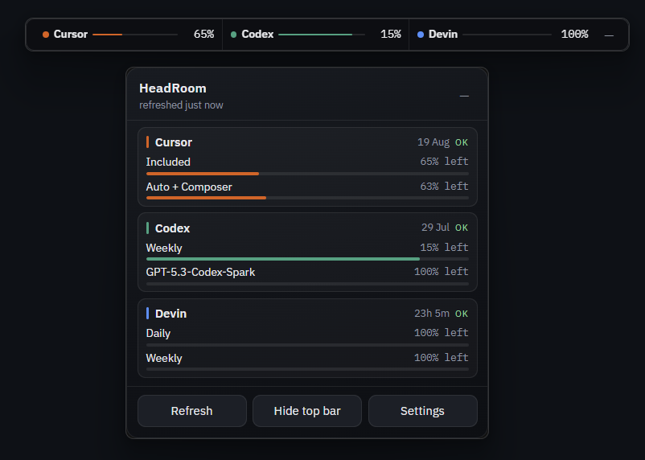

# HeadRoom

Windows 11 system-tray app that shows **remaining AI coding usage** for Cursor, ChatGPT Codex, Claude, Gemini, Devin, and MiniMax — with an optional always-on-top overlay.

Built with [Tauri 2](https://tauri.app/) + React.

[](LICENSE)
[](https://github.com/mmartain/HeadRoom)



## Features

- System tray icon with flyout panel
- Optional floating overlay (enabled providers only)
- Auto-detect Cursor login (`%APPDATA%\Cursor\...\state.vscdb`)
- Auto-detect Codex login (`%USERPROFILE%\.codex\auth.json`)
- Auto-detect Devin desktop login (`%APPDATA%\Devin\...\state.vscdb`) or CLI `credentials.toml`
- Optional Claude Code login (`%USERPROFILE%\.claude\.credentials.json`) — off by default
- Optional Gemini CLI OAuth (`%USERPROFILE%\.gemini\oauth_creds.json`) — off by default
- Optional Devin session / team service key overrides in Settings
- Optional MiniMax Token Plan usage via API key (`platform.minimax.io` → console → plan) — off by default
- Threshold toasts at 80% / 95% used
- Notify when usage windows reset (Claude 5-hour, Devin daily, Cursor monthly, …) — including resets that happened while HeadRoom was closed
- Modular **provider plugin** design (registry-only registration)
- Single-instance portable EXE

## Changelog

See [CHANGELOG.md](CHANGELOG.md) for the full release history.

## Privacy

All credentials stay on your machine under `%APPDATA%\headroom\`. HeadRoom only calls the same provider backends you already use. No HeadRoom cloud sync.

See [SECURITY.md](SECURITY.md) for reporting and storage details.

## Disclaimer

Provider personal usage endpoints are **unofficial** and may change, rate-limit, or break. Use at your own risk and respect each provider’s terms of service. Failures show per-provider errors without crashing the app.

## Requirements

- Windows 11
- [Node.js](https://nodejs.org/) 20+ (for development)
- [Rust](https://rustup.rs/) stable (for development)
- Microsoft C++ Build Tools (MSVC) for Tauri on Windows
- WebView2 (included with Windows 11)

## Develop

```bash
npm install
npm run tauri:dev
```

Left-click the tray icon to open the flyout. Right-click for Refresh / Toggle overlay / Quit.

## Portable single EXE

```bash
npm run build:portable
```

Output: `portable/HeadRoom.exe` (~15 MB)

That file is a **single portable binary** (UI assets are embedded). Copy it anywhere and run it.

Only one instance runs at a time. Launching the exe again shows the top status bar instead of starting a second process.

**Requirement:** WebView2 Runtime (ships with Windows 11). Settings/secrets still live under `%APPDATA%\headroom\` — the exe is portable; config is per-user.

Build note: Rust artifacts go to `%LOCALAPPDATA%\headroom-cargo-target` by default so Dropbox/synced folders do not lock `target/` mid-compile. Override with `CARGO_TARGET_DIR` if needed.

Installer build (optional): `npm run tauri:build`

## Releases

Releases are automated with GitHub Actions.

1. Ensure `main` is clean and up to date.
2. Cut a release:

```bash
npm run release -- patch   # 0.1.0 → 0.1.1
npm run release -- minor   # 0.1.0 → 0.2.0
npm run release -- major   # 0.1.0 → 1.0.0
npm run release -- 0.2.0   # exact version
```

That bumps versions in `package.json`, `src-tauri/Cargo.toml`, and `src-tauri/tauri.conf.json`, commits, tags `vX.Y.Z`, and pushes. The [Release](.github/workflows/release.yml) workflow then:

- builds the Windows portable `HeadRoom.exe`
- builds the NSIS installer
- publishes a GitHub Release with generated notes + artifacts

CI builds on every push/PR to `main` ([CI](.github/workflows/ci.yml)).

## Adding a provider

Architecture is registry-based (open-closed):

1. Add `src/providers/<id>/index.ts` exporting a `ProviderPlugin` (id, displayName, accentColor, `enabledByDefault`, auth capability).
2. Register it in [`src/providers/registry.ts`](src/providers/registry.ts) — **the only** place that lists concrete plugins.
3. Add `src-tauri/src/providers/<id>.rs` that returns a `UsageSnapshot`, and a match arm in [`src-tauri/src/providers/mod.rs`](src-tauri/src/providers/mod.rs).
4. Settings UI already renders credential fields from `auth`; flyout/overlay/alerts need no changes (disabled providers are hidden).

Do **not** add `switch (provider)` in Flyout, Overlay, or alert code.

## Settings location

| File | Purpose |
|------|---------|
| `%APPDATA%\headroom\settings.json` | Enabled providers, overlay, poll interval, notifications |
| `%APPDATA%\headroom\secrets.json` | Optional pasted tokens / keys (local only) |
| `%APPDATA%\headroom\last_resets.json` | Last-seen window reset timestamps (dedupes "limits reset" notifications across restarts) |

## License

MIT — see [LICENSE](LICENSE).
